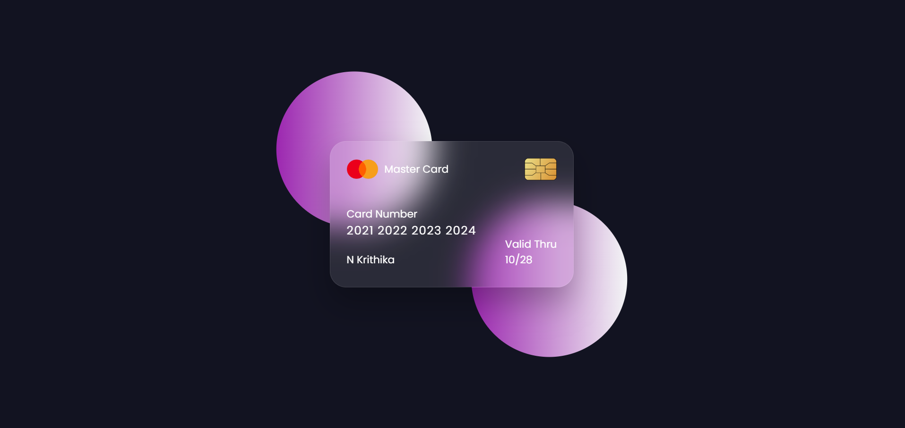
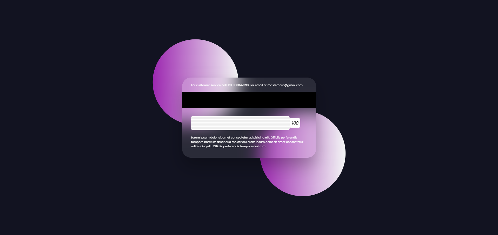

# Flipping Card UI 

A modern and interactive flipping card UI design built using HTML and CSS. This project demonstrates a sleek, 3D flip effect using CSS transitions, giving users a visually appealing way to view front and back details of a card.

## Project Overview

This Flipping Card UI showcases:
- **3D Flip Animation**: A smooth transition between the front and back sides of the card when hovered over.
- **Stylish Design**: Incorporates a glass effect with a minimal, clean layout.
- **Responsive Layout**: Adjusts based on screen size to provide a great user experience across devices.

### Output





### Key Features

- **Front Side**: Displays basic card details like a logo, card number, holder name, and valid date.
- **Back Side**: Shows additional information, including customer service details, magnetic strip, and signature.

## Project Files

- **`index.html`**: Contains the HTML structure of the Flipping Card.
- **`style.css`**: Contains the CSS styles for card flipping animations, layout, and styling.
- **`images/`**: Contains images used in the project, like the card logo and chip.

## How to Use

1. **Clone the Repository**:
   ```bash
   git clone https://github.com/Krithika-N-4/Flipping-Credit-Card.git
